# Daytrace

**Where did my day go?** Daytrace puts your phone and your computer on one timeline (apps, websites, sleep, meals
and calendar), and a local AI explains the day in plain words. Everything stays on your own network: there is no
cloud server, the AI runs on your own machine, and the hub shows you that it made 0 internet connections.

> Working name. Hackathon project.

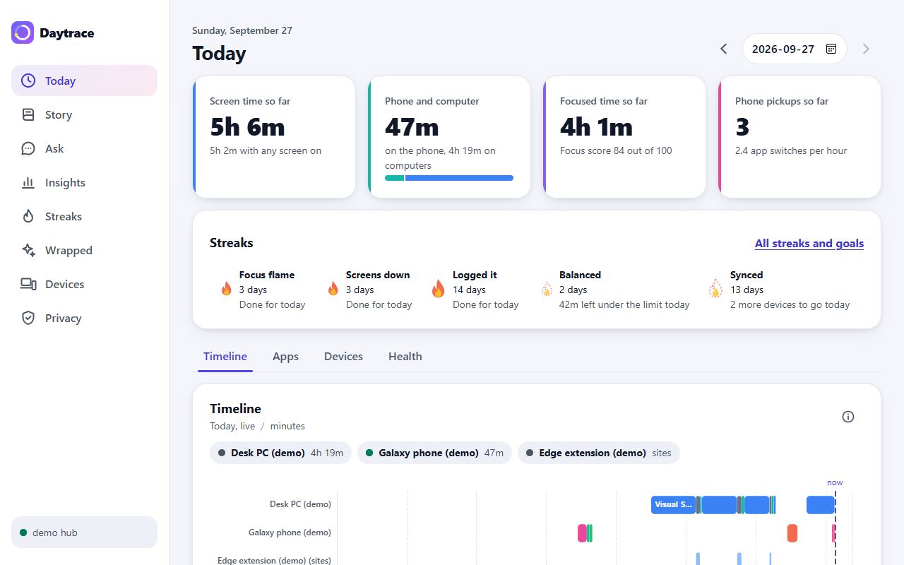

## What it does

- **One timeline for every device.** Each phone and computer gets its own lane, colored by what you were doing
  (work, study, social, video, chat, games), with sleep, meals and calendar events alongside.
- **A story of your day, written on your machine.** A local model turns the day's facts into a few sentences.
  Plain code works out every number, and each number the model writes is checked against those facts. If one
  doesn't match, you get a plain summary instead of a made-up figure.
- **Ask your day.** "How much YouTube after 11 pm last week?" The model looks things up with tools that read your
  data (totals, sessions, focus, sleep, calendar, plan against actual, streaks), and its answer goes through the
  same number check.
- **Insights.** Four tabs of charts: overview, apps and devices, focus and sleep, food and calendar. One of them
  asks whether late nights line up with less focus the next day, says how many days that rests on, and reminds
  you that it's a correlation, not a cause.
- **Streaks, goals and Wrapped.** Daily goals (focused time, time on social apps, bedtime), streaks, badges, and a
  weekly Wrapped card you can save as an image or share.
- **Nudges at the right moment.** A distracting app during a study block, scrolling past your bedtime, a streak
  about to break, or going over your social limit gets a gentle notification. Never more than one every 5 minutes.

## Screenshots

All from the demo profile's made-up data.

| Today | Story |
|---|---|
|  | 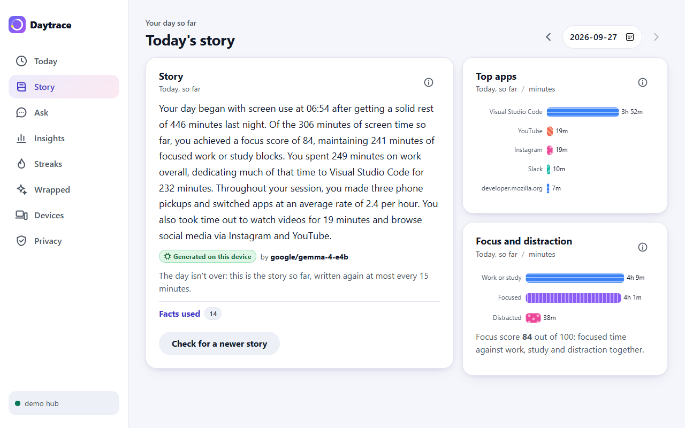 |
| **Ask** | **Insights** |
| 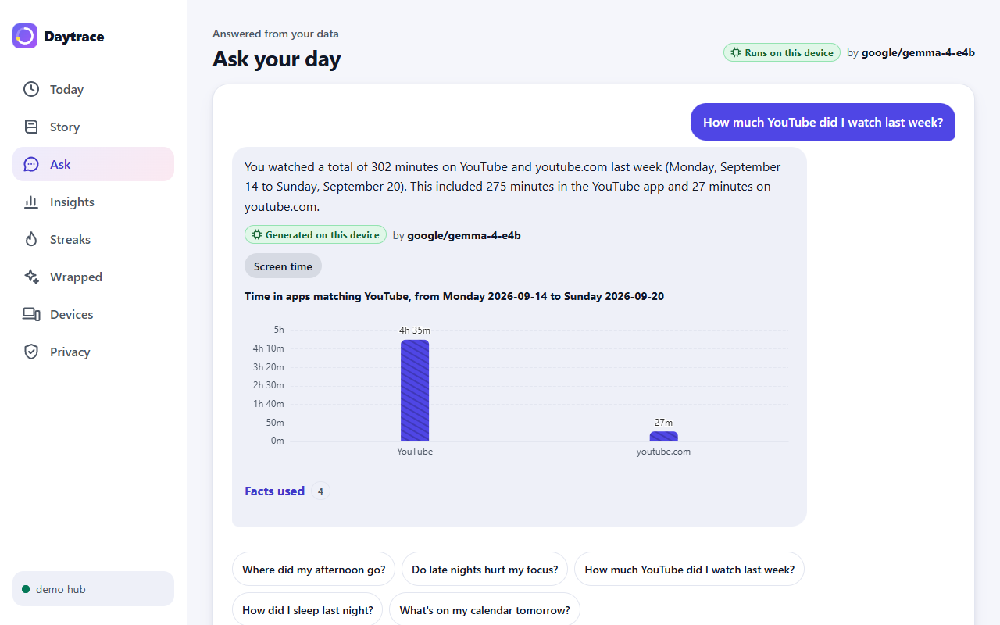 | 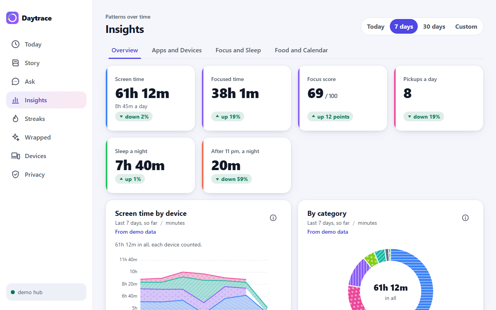 |
| **Streaks and goals** | **Wrapped** |
| 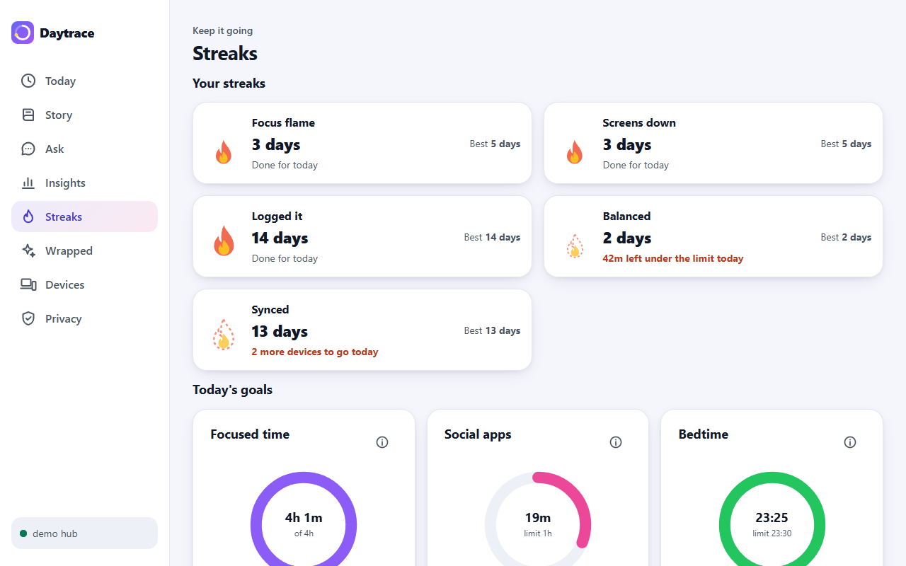 | 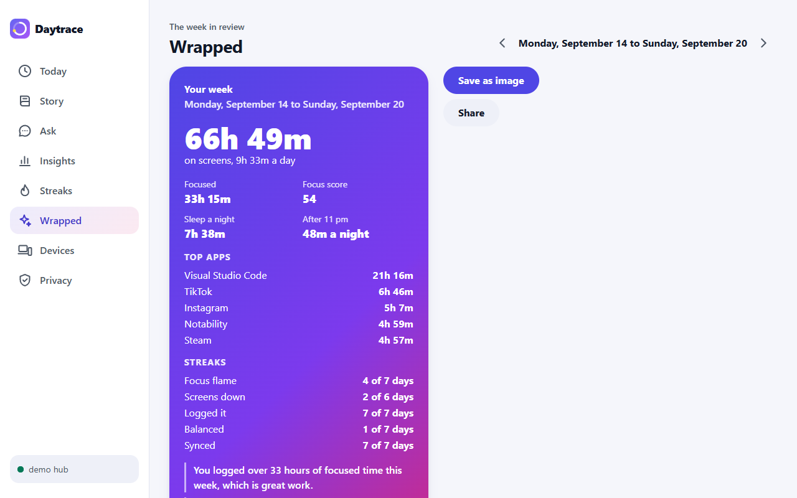 |
| **Privacy** | **Insights: focus and sleep** |
| 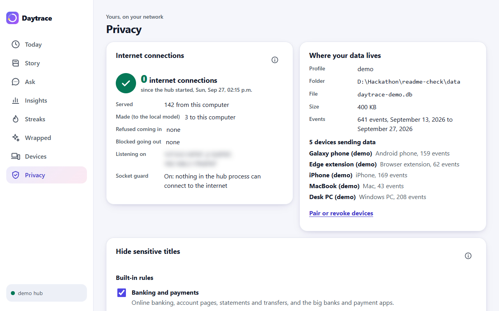 | 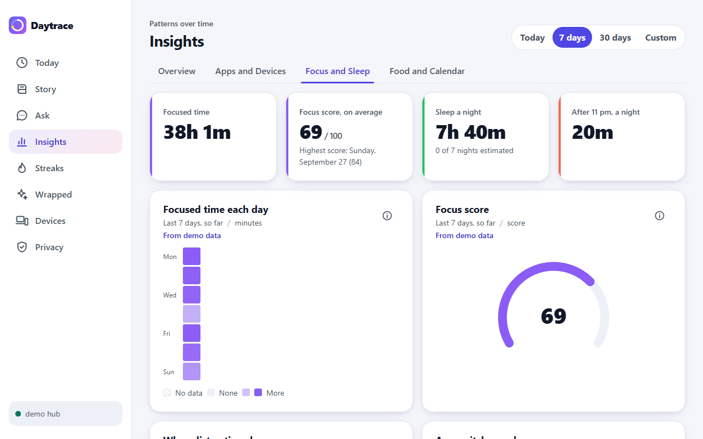 |

The same dashboard on a phone:

<p>
  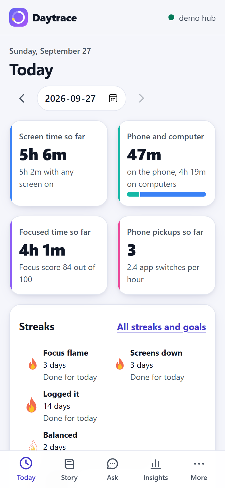
  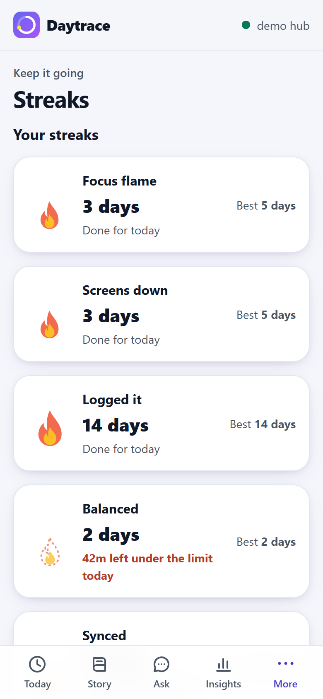
  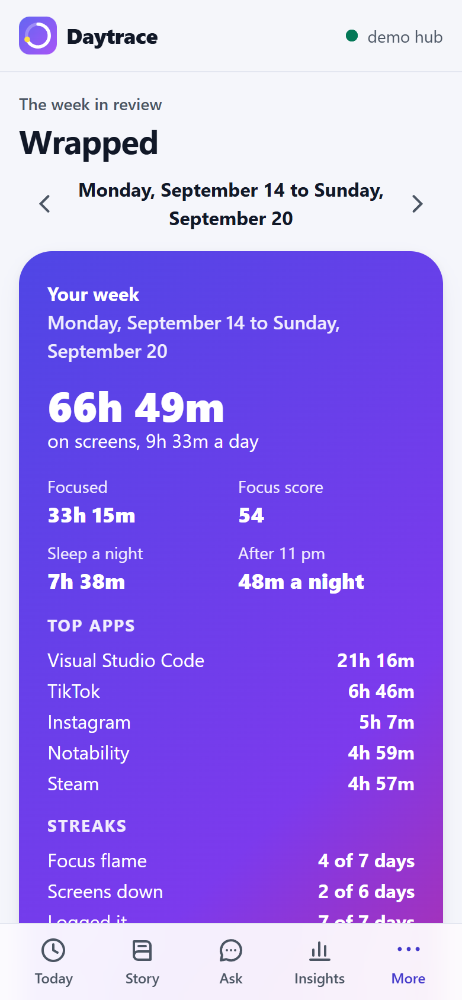
</p>

## Try it

The demo profile runs on port 8767 with 14 days of made-up data from five devices (a Windows PC, a MacBook, an
Android phone, an iPhone and a browser), so every page has something to show and none of your own data is involved.

**You need** Git, Python 3.12 or newer, and Node.js 22 or newer (we use 24 LTS). For the AI, optionally install
[LM Studio](https://lmstudio.ai), load a chat model that can call tools (we test with Gemma 4 E4B), and start its
server (Developer tab). The hub uses the first model the server lists. Without a model, the story and Wrapped show
plain summaries and Ask says the model is offline.

**Windows** (PowerShell):

```powershell
git clone https://github.com/SaiGaneshPS/daytrace.git
cd daytrace
python -m venv hub\.venv
hub\.venv\Scripts\python -m pip install -e .\hub
cd dashboard; npm ci; npm run build; cd ..
powershell -ExecutionPolicy Bypass -File .\scripts\dev-hub.ps1 -Profile demo
```

**macOS or Linux:**

```bash
git clone https://github.com/SaiGaneshPS/daytrace.git
cd daytrace
python3.12 -m venv hub/.venv
hub/.venv/bin/python -m pip install -e ./hub
(cd dashboard && npm ci && npm run build)
scripts/dev-hub.sh --profile demo
```

The script seeds the data, starts the hub, wakes the model up by writing yesterday's story and last week's Wrapped
ahead of time, and opens `http://localhost:8767`. Ctrl+C stops the hub. Run it again whenever you like: it only
ever replaces demo data.

- **The 3-minute demo:** [docs/demo-script.md](docs/demo-script.md), with a fallback for every step. Without a
  phone, `hub\.venv\Scripts\python -m daytrace_hub demo live` (or `demo nudge`) sends what the demo phone would.
  On macOS or Linux the Python is `hub/.venv/bin/python`.
- **Your own data:** `hub\.venv\Scripts\python -m daytrace_hub run --profile personal` starts the personal hub on
  port 8765. On Windows it records this computer's foreground app, window title and away time. A phone's browser
  pairs with it from the Devices page.
- **Profiles:** `personal` (8765, your data), `shared-dev` (8766, test data a teammate may reach over Tailscale) and
  `demo` (8767, seeded). Each has its own database in your user data folder, or in `DAYTRACE_DATA_DIR`.

## What works today

| Part | Status |
|---|---|
| **Hub** on Windows, macOS and Linux | Works. CI runs every test on all three. |
| **Dashboard** (PWA) in any modern browser | Works on computers and phones. Installing it on a phone and using it offline need HTTPS, which isn't built yet (DT-47, DT-35), so on a phone it is a normal web page for now. |
| **Windows desktop tracker** | Works: foreground app, window title and away time, using about 0.5% of one CPU core. |
| **Local AI** (LM Studio or Ollama) | Works with any OpenAI-compatible server on this computer or your LAN. Tested with Gemma 4 E4B. |
| **Nudges** | Work. Shown as a desktop notification (tried on Windows; the macOS and Linux paths are written but untried), and returned to the phone that triggered them. |
| **Android app** | Records app use and screen on and off, keeps every event on the phone until the hub has it, and syncs over Wi-Fi. Finding the hub and pairing by QR code are built and reviewed, and wait for a test on a network that lets the phone reach the PC (PR #16). Not built yet: sleep, steps, meals and calendar (DT-23), live mode and showing nudges (DT-24). |
| **iPhone** | The dashboard works in Safari once the browser is paired. The Shortcuts that send app use, health and meals aren't built yet (DT-26 to DT-28). |
| **macOS desktop tracker** | Not built yet (DT-17). |
| **Mac bridge** for full iPhone Screen Time | Not built yet (DT-29). |
| **Browser extension** (which site, domain only) | Not built yet (DT-18). |

The demo's seeded data covers every device above, so each page shows the full picture before the missing
collectors exist.

## The privacy promise

- **No cloud.** The hub runs on your computer and keeps everything in one SQLite file there.
- **No internet.** The hub listens only on this computer and your home network. Under that, a socket guard refuses
  any connection from the hub process to an internet address before a packet leaves, and the Privacy page shows
  the count: 0.
- **A local AI only.** The model runs on your machine or your LAN (the test profiles may also use your tailnet),
  and the hub refuses any other address for it.
- **Sensitive titles are never stored.** Banking, health portals, password managers and private browser windows
  become `[redacted]`, plus any words you add. The time still counts; only the words are gone.
- **Every device is paired.** A phone joins with a one-time code from the hub's own screen, gets its own token (the
  hub keeps only a hash of it), and can be revoked at any time.
- **Yours to take or delete.** Export everything as JSON, or delete everything after typing a confirmation phrase.
  Both work only from the hub's own computer.

The details, and how to check each one: [docs/privacy.md](docs/privacy.md).

## How it works

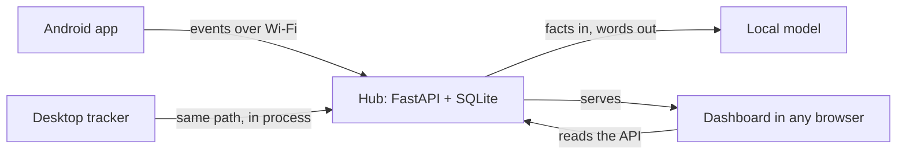

- **Collectors** send events (an app used from one time to another, a night's sleep, a meal) to
  `POST /api/v1/events`, each with its own token. Sending the same event twice never stores it twice.
- **The hub** turns events into sessions and works out every number in plain Python (`stats.py`): totals, focused
  time, pickups, sleep, streaks. The AI only puts those numbers into words.
- **The dashboard** is a React app the hub serves itself, so it has one address and needs nothing else.

More, with diagrams of pairing, sync, nudges and the privacy boundaries: [docs/architecture.md](docs/architecture.md).
The API: [docs/api.md](docs/api.md), and the event contract: [docs/event-schema.json](docs/event-schema.json).

## Repo layout

| Folder | What lives there |
|---|---|
| `hub/` | Python hub: API, storage, desktop tracker, stats, streaks, AI, nudges, redaction |
| `dashboard/` | Vite + React + TypeScript PWA |
| `android/` | Kotlin collector app (a sideloaded APK) |
| `browser-extension/` | Active-website collector (domain only) |
| `ios/` | iPhone Shortcuts: setup guide, payloads, exported shortcuts |
| `mac/` | Mac bridge for full iPhone Screen Time |
| `docs/` | Architecture, API contract, privacy, setup guides, demo script |
| `scripts/` | The demo launchers, sample events, and the Notion sync |

The folder and file layout is fixed (DT-1): changing it needs its own ticket.

## Working on it

```powershell
hub\.venv\Scripts\python -m pip install -e ".\hub[dev]"
cd hub; .venv\Scripts\python -m ruff check .; .venv\Scripts\python -m pytest; cd ..
cd dashboard; npm test; npm run build; npm run test:e2e; cd ..
```

- Set up a machine: [Windows](docs/setup-windows.md), [macOS](docs/setup-mac.md). Each part has its own guide:
  [hub](hub/README.md), [dashboard](dashboard/README.md), [android](android/README.md).
- Tickets live in Notion. Every change is a branch and a pull request with a bug review, and merges only with green
  checks. Read [CONTRIBUTING.md](CONTRIBUTING.md) before opening one.
