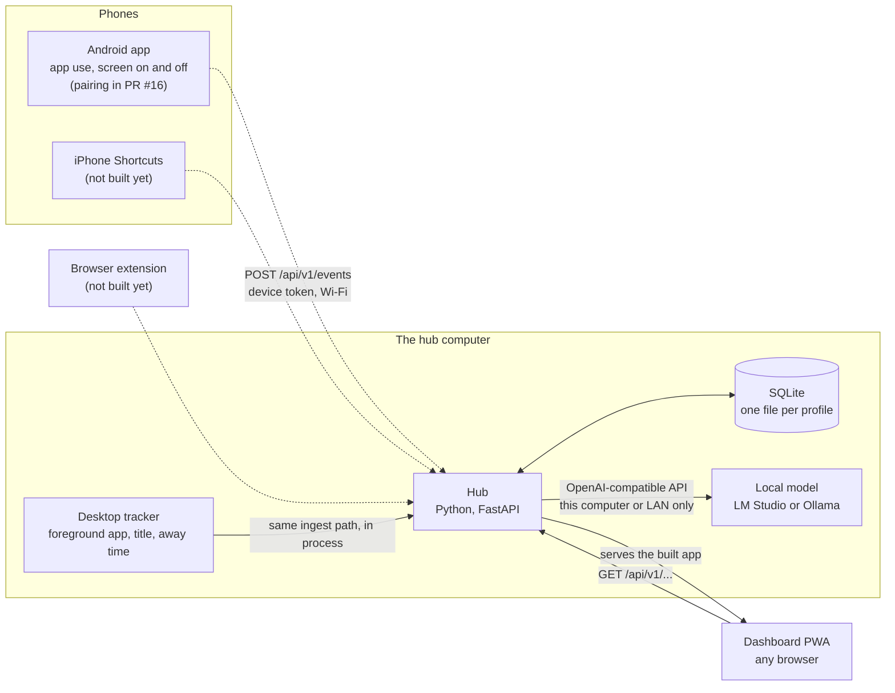
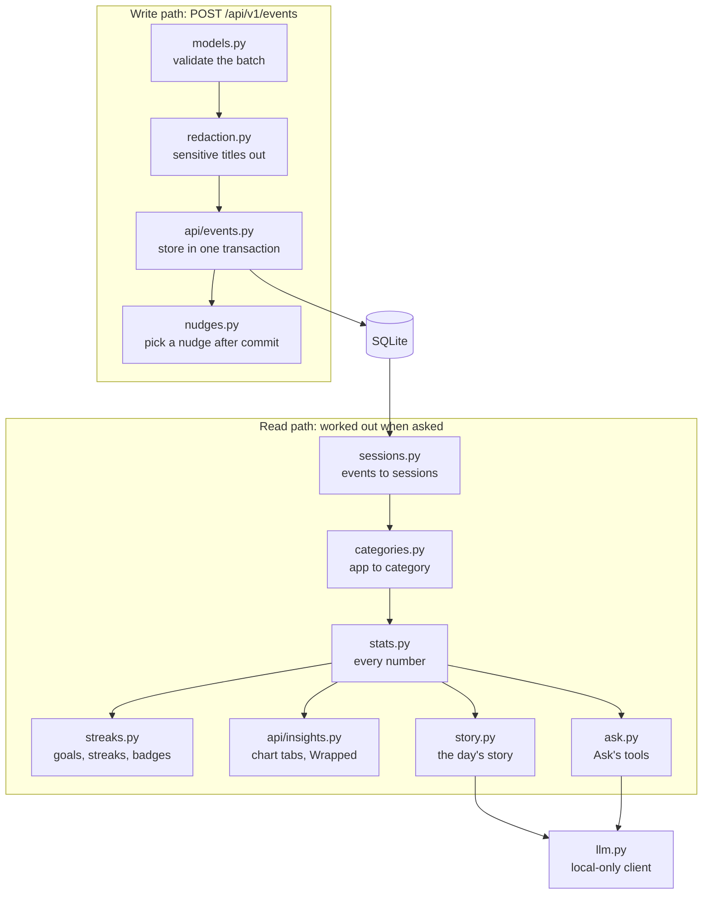
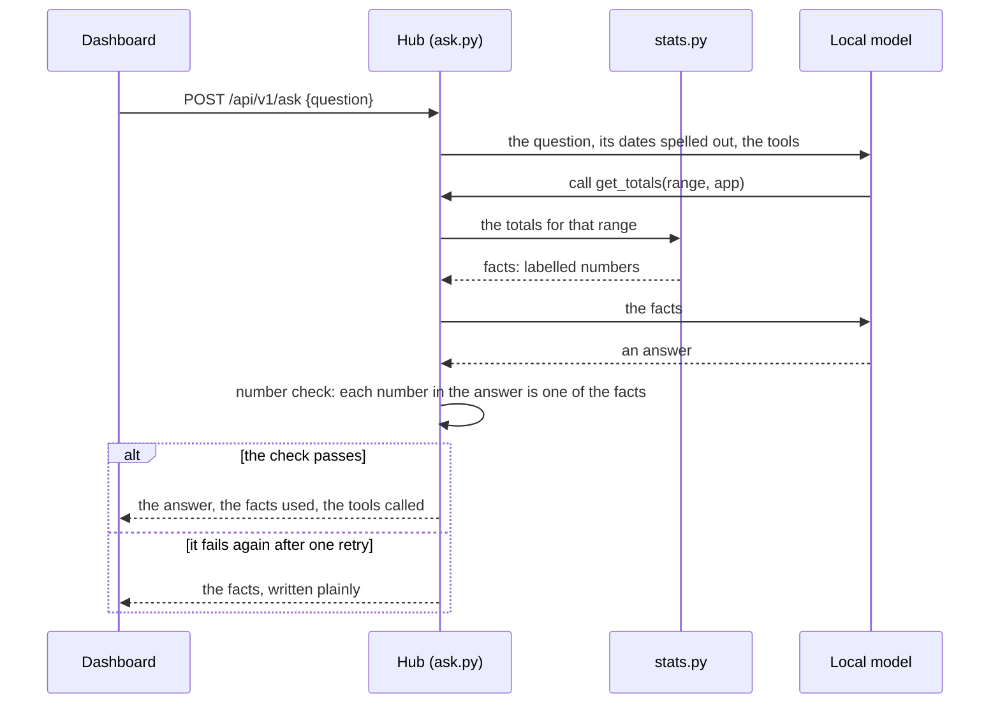
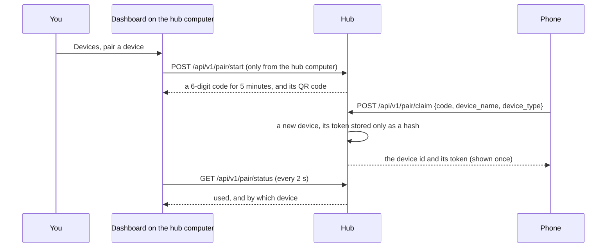
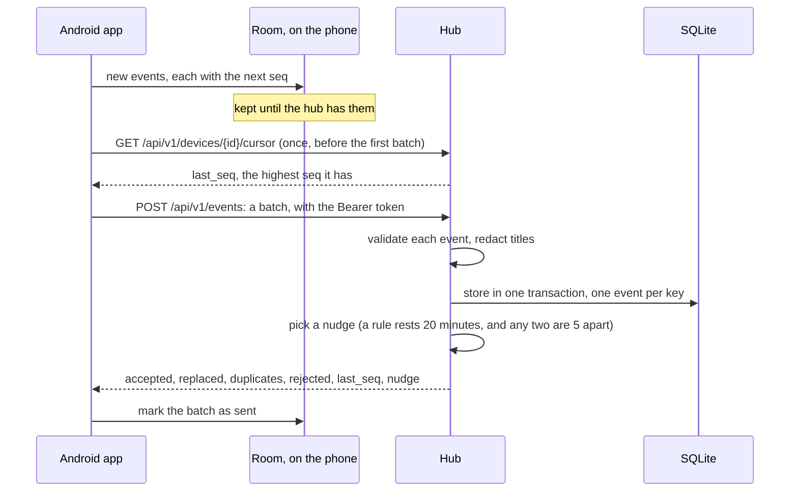
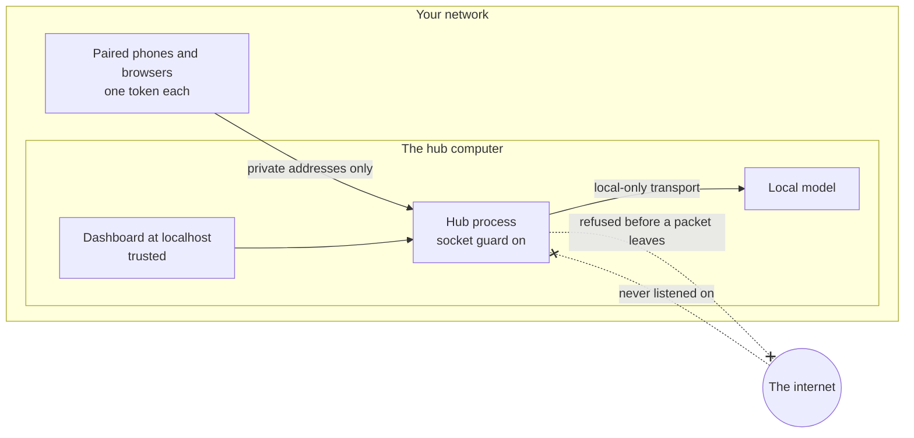

# Architecture

Daytrace has three parts. **Collectors** record what happened on each device, the **hub** keeps it and works it
out, and the **dashboard** shows it. All of it runs on your own devices, and the only network it uses is your own.

## Overview diagram

Dashed arrows are paths that don't work yet: the collector isn't built, or (Android) it can't pair until PR #16
merges.

- **One hub per profile.** `personal` (port 8765) holds your real data, `shared-dev` (8766) holds test data a
  teammate may reach over Tailscale, and `demo` (8767) holds seeded data. Each has its own SQLite file, so a demo
  never shows real data.
- **One contract.** Every collector sends the same events ([event-schema.json](event-schema.json)) to the same
  endpoint ([api.md](api.md)), so each one could be built against seeded data before the others existed.
- **Worked out when asked.** The raw events (and your settings) are the source of truth. Sessions, totals,
  streaks and charts are worked out from them on request, so a resent or corrected event changes every number
  that depends on it. Only a few things are kept on the side: the text of stories and Wrapped (written again when
  their facts change), badges (once earned, a badge is kept even if later data changes), and the log of nudges
  sent.

## Hub

A Python 3.12 package, `hub/daytrace_hub`, running FastAPI on uvicorn, with SQLite in WAL mode.

| Module | Its job |
|---|---|
| `app.py` | Builds the app, serves the dashboard, and runs the server on the allowed addresses only (`HubServer`), with the socket guard. |
| `config.py` | Profiles, folders, which networks count as yours, and the ledger of every connection (`NetworkLedger`). |
| `db.py`, `migrations/` | SQLite, the migrations in order, and `data_version()`: a counter that database triggers raise when events, categories or devices change. The caches are keyed on it. |
| `models.py` | The event contract in Pydantic. Tests check it and `docs/event-schema.json` against the same example payloads. |
| `auth.py` | Device tokens (stored as SHA-256 hashes), the trusted dashboard on the hub computer, and who may read or change what. |
| `discovery.py` | Which addresses to listen on, and advertising the hub over mDNS (`_daytrace._tcp`). |
| `api/events.py` | Ingest: validate, redact, store without duplicates, then pick a nudge. |
| `sessions.py` | Events to sessions: pairs opens with closes, merges heartbeats, cuts out away time, splits at midnight. |
| `categories.py` | App or site to category: your choice first, then the collector's hint, then the built-in list, then the AI's guess, then "other". |
| `stats.py` | Every number: totals by app, category, device, hour and day; focused time; the focus score; pickups; app switches; late-night use; sleep; plan against actual; the late-night correlation. |
| `streaks.py` | Goals (`data/streak_rules.json`), streaks, badges, and what today still needs. |
| `story.py`, `ask.py` | The AI: the day's story, Wrapped's lines, and Ask's tools, all behind the number check. |
| `llm.py` | The client for the local model, which can only reach this computer or your LAN. |
| `nudges.py`, `notify.py` | Nudge rules, cooldowns, the log, and desktop notifications. |
| `redaction.py` | The built-in and your own redaction rules, applied before anything is stored. |
| `tracker/` | The desktop tracker (Windows now; macOS in DT-17). |
| `seed.py` | Demo data, and `demo live` / `demo nudge` for the demo. |

**Caches.** The day's story and Wrapped's lines are stored (`story_cache`, `wrapped_cache`) with the facts they
came from, so they are only written again when those facts change. Insights tabs and streak readings are kept in
memory, keyed on `data_version()`, so a new event shows at once. A range that isn't over yet is worked out again
after at most a minute (today's story after 15 minutes).

## Collectors

All collectors speak one contract: `POST /api/v1/events` with a batch of up to 500 events and the device's token.

- **Kinds:** `app_session`, `app_open`, `app_close`, `window`, `web`, `afk`, `screen_on`, `screen_off`, `sleep`,
  `steps`, `meal`, `calendar_event`.
- **No duplicates.** The hub keeps one event per key and device. The key is the event's `external_id` when it has
  one, else its `seq` (a number that grows per device), else a hash of what it says (iPhone Shortcuts send neither).
  - Sending the same event again is always safe: it is counted as a duplicate.
  - To make a span longer, send it again with the same `external_id`: the hub replaces the stored copy. The
    desktop tracker and the Android app both do.
  - A different event under a `seq` already used is refused (`seq_conflict`), so a collector whose numbering
    restarted numbers its events again instead of losing them.
- **The reply** (`IngestResult`) has `accepted`, `replaced` and `duplicates` (counts), `rejected` (which events were
  refused, and why), `last_seq` (the highest `seq` stored) and `nudge` (if one fired).

| Collector | How it works | Status |
|---|---|---|
| Windows desktop tracker | Reads the foreground window every 2 s. One span per app and title, growing while it lasts. Away after 3 minutes without input, or at once when locked. Runs inside the hub and writes through the same ingest code. | Built |
| Android app | Reads `UsageStatsManager` into a Room database on the phone. A WorkManager job syncs every 15 minutes on an unmetered network, and "Sync now" syncs at once. Sends only to private addresses. | Built, but it can't pair (and so sends nothing) until PR #16 merges |
| Health and calendar on Android | Health Connect and the phone's calendar | DT-23 |
| macOS desktop tracker | The same tracker on the Mac | DT-17 |
| Browser extension | The active tab's domain, never the full address | DT-18 |
| iPhone Shortcuts | App opens and closes, health, meals by voice | DT-26 to DT-28 |
| Mac bridge | Full iPhone Screen Time through the Mac | DT-29 |

## Dashboard

A React 19 + TypeScript app built with Vite, in `dashboard/`. The hub serves the build from `dashboard/dist` at
`/`, with a Content-Security-Policy that allows only the hub itself.

- **Pages:** Today (the timeline), Story, Ask, Insights (four tabs), Streaks, Wrapped, Devices, Privacy.
- **Typed API.** `src/api/schema.d.ts` is generated from the hub's OpenAPI description, and `src/api/client.ts`
  checks every path, query, body and reply against it at compile time.
- **Charts and motion.** ECharts with one theme built from the design tokens (`src/theme`), patterns as well as
  colors for each category, and motion that respects reduced motion.
- **Who may open it.** On the hub computer, `http://localhost:<port>` is trusted and needs no pairing. Any other
  browser pairs as a `viewer` on the Devices page: it can read everything and change settings, but can't send
  events. A collector's token (a phone app, a Shortcut, the extension) can send events and can also read, but
  can't change settings.
- **Tests.** Vitest for the pieces, and Playwright on a desktop and a phone for every page: layouts from 280 px
  wide and at 200% text, touch targets, and accessibility with axe. Hub tests check that the main JSON fixtures
  the Playwright tests answer with are the hub's real answers.

## Local AI

Plain code works out every number, and the model only puts them into words.

- **The number check** (`story.py`) reads every amount in the model's text as what it is: a duration, a clock
  time, a percentage, a count, a date. Each one must match a fact of the same kind, at the precision it is
  written in.
- **Story and Wrapped** work the same way, without tools: the day's facts go in and a few sentences come out. If
  the check fails twice, a plain template writes them instead.
- **Limits:** at most 4 tool calls per question, 31 days per call, and 4 minutes per question. After that, the
  facts found so far are the answer.
- **Any local server.** Any OpenAI-compatible server works. LM Studio at `http://127.0.0.1:1234/v1` is the
  default; for Ollama, set `DAYTRACE_LLM_BASE_URL=http://127.0.0.1:11434/v1`. `DAYTRACE_LLM_MODEL` picks the
  model (else the first one the server lists). `GET /api/v1/ai/status` says whether the model answers and whether
  it can call tools.

## Data flow and sync

### Pairing

- A code works once, and wrong guesses are limited per client and per code.
- The Android app finds the hub over mDNS or from the QR code (PR #16). A phone's browser scans the "Phone
  browser" QR code, which opens the Devices page with the code and pairs the browser as a viewer.
- Revoking a device (on the hub computer) stops its token working at once.

### An event and a nudge

- **Nothing is lost.** The phone keeps each event until the hub says it has it. A request that fails is sent
  again later, and the hub ignores what it already has.
- **A refused event** (one that breaks the contract) stays on the phone and isn't sent again. A token that
  stopped working asks you to pair again.
- **Nudge rules**, in order: a distracting app during a focus block in your calendar; social or video after your
  bedtime goal; a streak you can still keep, from 20:00; going over your social apps goal. Only activity from the
  last 10 minutes counts, and every nudge is logged. The desktop tracker shows its nudges as notifications on the
  computer. Each rule can be switched off.

## Privacy boundaries

| Boundary | What holds it |
|---|---|
| **Where it listens** | Only 127.0.0.1, ::1 and your Wi-Fi or Ethernet adapter's own addresses: never every interface, and never a public address. It follows a new address within about 15 s. The tailnet only for `shared-dev`. |
| **Who it answers** | This computer and your LAN. It refuses a Host name that could be DNS rebinding, and a request made by another web page. |
| **What it reaches** | Only the local model, through one transport that checks every address a name points to, and sends no proxy settings, redirects or stray credentials. |
| **The socket guard** | A Python audit hook refuses every `socket.connect` and `socket.sendto` in the hub process to an internet address, whichever library asks. It can't see what doesn't go through Python's socket module: a C extension's own sockets, uvloop's (which uvicorn uses on macOS and Linux), or another process. The hub's own outgoing path, to the model, uses Python sockets. `GET /api/v1/privacy/network` counts every connection made, blocked, served and refused. |
| **What is stored** | Redaction runs before storage, on every way in, so a sensitive title is never written. SQLite's `secure_delete` overwrites deleted rows. |
| **Who may read and change** | Reading takes any paired device's token, or no token from the dashboard on the hub computer. Changing settings takes a viewer token (a paired browser) or the hub computer: a collector's token can send events and read, but can't change settings. Pairing codes, revoking, export and delete work only on the hub computer. |

The full list, and how to check each one: [privacy.md](privacy.md).
